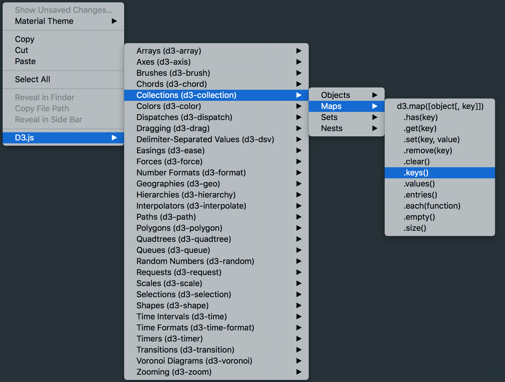

D3.js v4 for Sublime Text 3
===========================

This is a collection of code completions and snippets to make working with and learning [D3.js][D3js] a little easier and quicker.

## Featuring: ##

* Code completions and context menu for the entire D3.js library.
	* The context menu is organized to match D3's [API Reference][D3-Docs] and is accessible by right-click, two-finger tap, or ctrl+click.
	* Example:

		

* code snippets for the changes from v3 to v4.
	* Accessible from the command pallette (Mac: Cmd+Shift+P, Windows: Ctrl+Shift+P).
	* Typing a v3 command or partial string will suggest the v4 equivalent.

* convenience snippets of commonly used features of D3.js 

Please let me of any typos, if anything is missing, or of any requests for convenience snippets to be added.

## Installation: ##

### Without Package Control ###
Download the [zipped repo][zipped-repo] and unzip it into Sublime Text's packages folder:
* Mac: ~/Library/Application Support/Sublime Text 3/Packages/ 
* Windows: C:\Users\%userprofile%\AppData\Roaming\Sublime Text 3\Packages

===========================

This is partially an update to [fabriciotav][fabriciotav]'s Sublime Text 2 plug-in, [D3.js snippets for Sublime Text 2][d3-snippets]

[D3js]: http://d3js.org/
[D3-Docs]: http://github.com/d3/d3/blob/master/API.md
[zipped-repo]: http://github.com/alexmacy/D3.js-v4-for-Sublime-Text/archive/master.zip
[fabriciotav]: http://github.com/fabriciotav
[d3-snippets]: http://github.com/fabriciotav/d3-snippets-for-sublime-text-2
